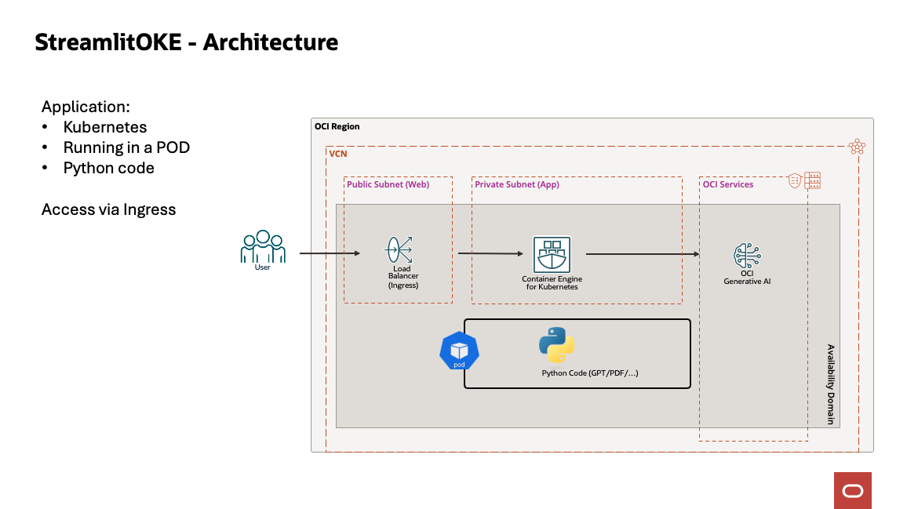

## StreamlitOKE

This script will deploy several applications using OCI Generative AI:

- GPT
- Chat with a PDF
- Compare Documents
- Summarize Documents
- Check Resume
- Chat with a Webpage
- ...

## Architecture

### Usage

### Commands

- starter.sh         : Show the menu
- starter.sh help    : Show the list of commands
- starter.sh build   : Build the whole program: Run Terraform, Configure the DB, Build the App, Build the UI
- starter.sh destroy : Destroy the objects created by Terraform
- starter.sh env     : Set the env variables in BASH Shell

### Directories

- src         : Sources files
  - app       : Source of the Backend Application
  - ui        : Source of the User Interface
  - db        : SQL files of the database
  - terraform : Terraform scripts
  - oke       : Contains the deployment files to Kubernetes

Help (Tutorial + How to customize): https://www.ocistarter.com/help

### Next Steps:

- Run:
  ./starter.sh
